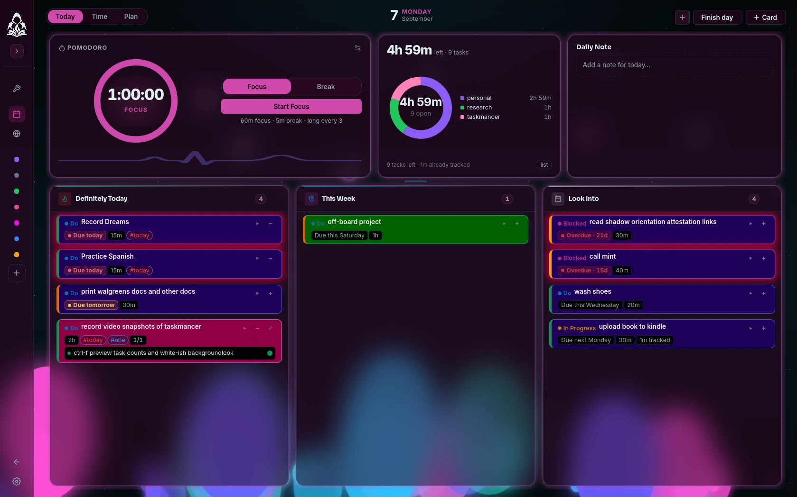
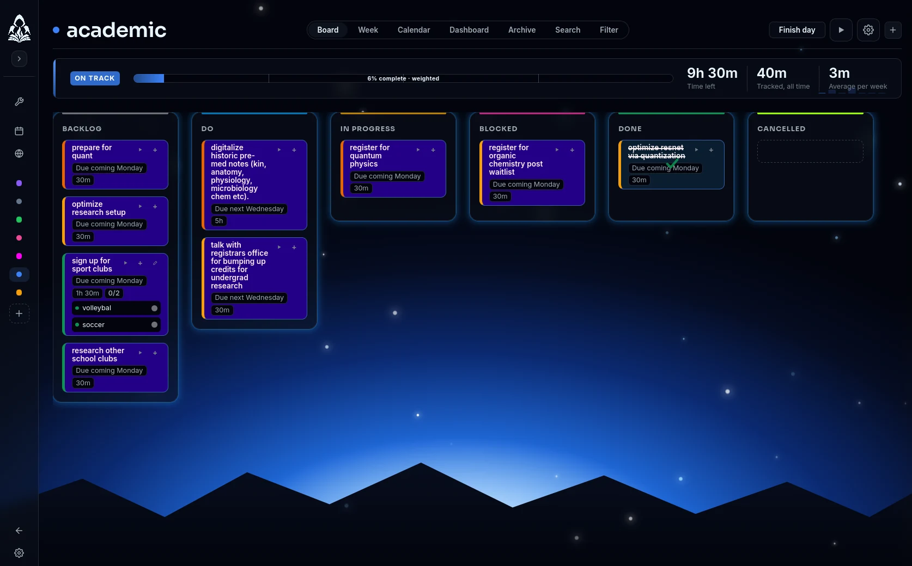
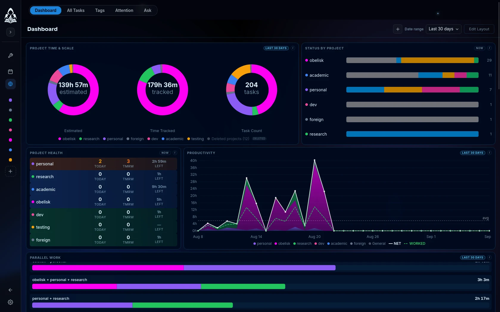

<div align="center">


# Obelisk

**Tools for running your own life, that run entirely on your own machine.**

<!--
  Plain links rather than shields.io buttons: GitHub has no real buttons, so
  buttons mean remote images -- a network dependency in the first thing anyone
  sees, and they reflow badly on a phone. Every target is a heading GitHub
  already anchors.
-->
[**Install**](#install) · [Taskmancer](#taskmancer) · [Zorynda](#the-rest-of-the-suite) · [Dreambase](#the-rest-of-the-suite) · [Warder](#the-rest-of-the-suite) · [Alexandria](#the-rest-of-the-suite) · [Obsidian&nbsp;Bridge](#the-rest-of-the-suite) · [Photos](#the-rest-of-the-suite) · [Updates](#updates)

</div>

---

<table>
<tr>
<td width="33%" valign="top">

### Fully Local and Private

No account, no remote servers, no one has access to your data but you. Everything lives in plain or encrypted files on
your disk that you own.

</td>
<td width="33%" valign="top">

### Beautiful Design

Careful typography, motion that helps rather than decorates, and customizable themes with
real depth.

</td>
<td width="33%" valign="top">

### Powerful Customization

All apps in the Obelisk suite are designed to bend to your standards and workflow. Here you shape
the thing itself, the defaults are only somewhere to start.

</td>
</tr>
</table>

---

## Install

You install the launcher once. Every app comes from inside it, and uninstalls
through your system's own app list whether or not the launcher is still
around.

<details open>
<summary><b>Debian, Ubuntu, Mint</b></summary>

```bash
curl -L https://github.com/bogdan-tr/obelisk-suite/releases/download/obelisk-shell-v0.1.3/obelisk-shell_amd64.deb -o /tmp/obelisk.deb
sudo apt install /tmp/obelisk.deb
```

</details>

<details>
<summary><b>Fedora, RHEL, openSUSE</b></summary>

```bash
curl -L https://github.com/bogdan-tr/obelisk-suite/releases/download/obelisk-shell-v0.1.3/obelisk-shell_x86_64.rpm -o /tmp/obelisk.rpm
sudo dnf install /tmp/obelisk.rpm
```

</details>

<details>
<summary><b>Arch, Manjaro, EndeavourOS</b></summary>

The launcher ships as an AppImage for Arch-based systems.

```bash
mkdir -p ~/Applications
curl -L https://github.com/bogdan-tr/obelisk-suite/releases/download/obelisk-shell-v0.1.3/obelisk-shell_amd64.AppImage -o ~/Applications/obelisk
chmod +x ~/Applications/obelisk
~/Applications/obelisk
```

If it does not start, AppImages need FUSE 2:

```bash
sudo pacman -S --needed fuse2
```

</details>

<details>
<summary><b>Any Linux, without installing anything</b></summary>

The AppImage is a single self-contained file: no install, no root, and
removing it is deleting the file.

```bash
curl -L https://github.com/bogdan-tr/obelisk-suite/releases/download/obelisk-shell-v0.1.3/obelisk-shell_amd64.AppImage -o obelisk
chmod +x obelisk
./obelisk
```

To keep it, move it somewhere permanent (for example `~/Applications`) and
launch it from there; app data lives in `~/.local/share` either way, so
moving the file later loses nothing.

</details>

<details>
<summary><b>macOS</b></summary>

```bash
curl -L https://github.com/bogdan-tr/obelisk-suite/releases/download/obelisk-shell-v0.1.3/obelisk-shell_universal.dmg -o ~/Downloads/obelisk.dmg
open ~/Downloads/obelisk.dmg
```

Drag **Obelisk** into **Applications**. The first launch needs one extra
step because the app is not notarized with Apple: right-click the app in
Applications and choose **Open**, then **Open** again in the dialog. macOS
remembers the choice; every later launch is normal. One binary covers both
Apple Silicon and Intel.

</details>

<details>
<summary><b>Windows</b></summary>

Download and run the installer:

**[obelisk-shell_x64-setup.exe](https://github.com/bogdan-tr/obelisk-suite/releases/download/obelisk-shell-v0.1.3/obelisk-shell_x64-setup.exe)**

SmartScreen may show "Windows protected your PC" because the installer is
not code-signed with Microsoft: click **More info**, then **Run anyway**.
The launcher appears in the Start menu, and uninstalls from
Settings → Apps like anything else.

</details>

---

## Taskmancer

<details open>
<summary><b>Everything about Taskmancer</b> — the demo, the screenshots, how to install it, and what it does</summary>


<div align="center">

<video src="https://github.com/user-attachments/assets/1407be46-a8ce-471e-9b9e-9b93b3a70b92" controls muted width="860"></video>

<!--
  An animated WebP, not the mp4, and not a GIF. Round FE, measured rather
  than assumed.

  The <video> tag that used to be here was never the problem -- GitHub's
  sanitiser keeps it. The FILE was: raw.githubusercontent.com serves
  taskmancer-demo.mp4 as `application/octet-stream` with
  `X-Content-Type-Options: nosniff`, so the browser is handed a generic
  download and forbidden from guessing otherwise. No player can decode that,
  which is why it rendered blank and only the fallback link worked. The same
  host serves taskmancer.png as image/png and shot-today.webp as image/webp,
  so images are fine and video simply is not available from there.

  GIF was weighed again with real numbers and stays declined: the same film
  at the same 800px/10fps is 33.7 MB as a GIF against 5.8 MB as WebP, with
  256 colours that band the theme reel badly. This file is 860px, 10fps,
  6.3 MB.

  This URL is GitHub's attachment store, the one host that serves a real
  video/mp4 -- uploaded by dragging the file into an issue. raw and the
  release assets both serve application/octet-stream with nosniff, which
  no browser will decode as video.
-->
<sub><i><a href="https://github.com/bogdan-tr/obelisk-suite/raw/main/assets/taskmancer-demo.mp4">Download the demo in full quality</a> — 1280&times;800, 30fps.</i></sub>

</div>

<table>
<tr>
<td width="150" align="center" valign="top">
  
  <br><sub><b>v0.1.3</b><br>available now</sub>
</td>
<td valign="top">

**Taskmancer is designed for optimizing overloaded, complex workflows**

**Custom task suggestion rules.** Every other app buries "what should
I do now" in a hidden formula. Here you write it: weigh by priority, project,
age, urgency, whatever actually matters to you, and the answer comes back in
your own terms.

**Navigate with vim and keyboard** One shortcut makes a task from anywhere.
Vim motions move you through everything. You can run a whole day without
reaching for the mouse.

**Measure everything** Number of tasks, time spent, time predicted, status and project distributions, what's likely to get cancelled. You name it.

</td>
</tr>
</table>

<table>
<tr>
<td width="33%" align="center"><br><sub><b>Today</b> — what to do next, ranked</sub></td>
<td width="33%" align="center"><br><sub><b>Board</b> — every task, by status</sub></td>
<td width="33%" align="center"><br><sub><b>Dashboard</b> — widgets you arrange</sub></td>
</tr>
</table>

<details>
<summary><b>More about Taskmancer</b></summary>

<br>

**Things inherit.** Projects hold subprojects, and settings flow down through
them. Set a rule where it makes sense and everything beneath it follows,
unless you say otherwise.

**Subtasks and chains.** A chain runs in order: finish one link and the next
opens itself, so a sequence you would otherwise carry in your head carries
itself.

**Tools for the tedious parts.** Work unblocks itself the moment its blocker
clears. Recurring tasks pause for a fortnight and come back with your changes
intact. Built in, not something you assemble.

**A pomodoro timer that earns its place.** Tracked time is what makes next
week's forecast true, rather than a report nobody opens.

**Plan a day against real hours.** Lay the work onto a timeline and see
whether it fits. What does not fit is the useful part. Taskmancer already
draws your real calendar alongside it and plans around the gaps — that part
switches on once Zorynda ships and the two find each other on your machine.

**Over seventy themes.** Cosmic, aquatic, nature, crystal, glass. The frosted
surfaces are tunable per theme: tint, blur, brightness, transparency.

**Local AI, if you want it.** An optional assistant that runs against a model
on your own machine. Off by default, and nothing leaves the room.

</details>

### Installing Taskmancer

> **The easy way:** install **Obelisk** above, open it, and press Install on the
> Taskmancer tile. You get every app from one place, updates included, and you
> can add Zorynda and the rest as they arrive without hunting for downloads.

Or take it on its own — it is a complete app and needs nothing else:

<details>
<summary><b>Debian, Ubuntu, Mint</b></summary>

```bash
curl -L https://github.com/bogdan-tr/obelisk-suite/releases/latest/download/taskmancer_amd64.deb -o /tmp/taskmancer.deb
sudo apt install /tmp/taskmancer.deb
```

</details>

<details>
<summary><b>Fedora, RHEL, openSUSE</b></summary>

```bash
curl -L https://github.com/bogdan-tr/obelisk-suite/releases/latest/download/taskmancer_x86_64.rpm -o /tmp/taskmancer.rpm
sudo dnf install /tmp/taskmancer.rpm
```

</details>

<details>
<summary><b>Any Linux (AppImage)</b></summary>

```bash
mkdir -p ~/Applications
curl -L https://github.com/bogdan-tr/obelisk-suite/releases/latest/download/taskmancer_amd64.AppImage -o ~/Applications/taskmancer
chmod +x ~/Applications/taskmancer
~/Applications/taskmancer
```

No install, no root. Delete the file to uninstall.

</details>

<details>
<summary><b>macOS (Apple Silicon and Intel)</b></summary>

```bash
curl -L https://github.com/bogdan-tr/obelisk-suite/releases/latest/download/taskmancer_universal.dmg -o ~/Downloads/taskmancer.dmg
open ~/Downloads/taskmancer.dmg
```

Drag Taskmancer to Applications. It is not notarised yet, so the first launch
needs **right-click → Open** rather than a double-click; macOS then remembers
the choice.

</details>

<details>
<summary><b>Windows 10 and 11</b></summary>

Download **[taskmancer_x64-setup.exe](https://github.com/bogdan-tr/obelisk-suite/releases/latest/download/taskmancer_x64-setup.exe)**
and run it.

The installer is not code-signed yet, so SmartScreen will show
*"Windows protected your PC"*. Choose **More info → Run anyway**. Taskmancer
then appears in the Start menu and uninstalls through **Settings → Apps** like
any other program.

</details>

</details>

---

## The rest of the suite

Designed, specified, named, and not yet released. Here so you can see where
this is going.

<table>
<tr>
<td width="84" align="center"></td>
<td><b>Zorynda</b> · calendar<br><sub>Local and private by construction — no account, no sync server — and good-looking with it. Beyond month and week, timelines: long plans broken into stages that unlock one another, laid against real dates.</sub></td>
</tr>
<tr>
<td width="84" align="center"></td>
<td><b>Dreambase</b> · dream journal<br><sub>Entries encrypted at rest and tagged automatically, then read back by a model on your own hardware to show what recurs — the people, the places, the signs. Nothing leaves the machine.</sub></td>
</tr>
<tr>
<td width="84" align="center"></td>
<td><b>Warder</b> · habits and addictions<br><sub>Fought with evidence: one check-in a day, statistics that do not flatter you, and real self-experiments — define a change, run it a fortnight, see what moved.</sub></td>
</tr>
<tr>
<td width="84" align="center"></td>
<td><b>Alexandria</b> · passwords<br><sub>A local, encrypted library for passwords and everything else worth locking — and nothing is ever displayed: clicking a card copies the secret without putting it on screen.</sub></td>
</tr>
<tr>
<td width="84" align="center"></td>
<td><b>Obsidian Bridge</b> · study material<br><sub>Reads the Obsidian vault you already keep and turns its notes into cards, quizzes and summaries — every change previewed before it lands, and the version it replaced recoverable.</sub></td>
</tr>
<tr>
<td width="84" align="center"></td>
<td><b>Photos</b> · library<br><sub>Your whole photo library at a fraction of the space and no slower to open — stored compressed, expanded only when you look at one.</sub></td>
</tr>
</table>

---

## Updates

Apps check for their own, and the launcher notices too: a dot on the block, a
count in the corner, never a dialog in your way.

Every release is signed. Each app checks an update against a key compiled
into it and refuses anything that does not verify, so a compromised release
page cannot hand you a replacement binary.

---

## Uninstalling

Through your system's normal app list, your software centre, or
`apt remove` / `dnf remove`. The launcher hands packages to your OS installer
rather than managing them itself, so removing the launcher strands nothing.

Your data stays behind on purpose, so reinstalling picks up where you left
off. To clear that too:

```bash
rm -rf ~/.local/share/com.taskmancer.app
```

---

<div align="center">
<sub>

[Releases](https://github.com/bogdan-tr/obelisk-suite/releases) · [Report a problem](https://github.com/bogdan-tr/obelisk-suite/issues)

</sub>
</div>
